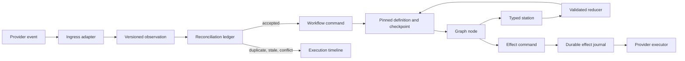

# Control-plane architecture

Forge coordinates distributed systems that can retry, race, fail mid-write, or
disagree. Its control plane makes the ownership of external facts, workflow
decisions, agent work, and provider mutations explicit.

## Ownership model

| Record | Owner | Purpose |
| --- | --- | --- |
| Observation | Jira, source control, or poller | A versioned external fact and delivery identity. |
| Observation decision | Reconciliation ledger | Whether evidence is accepted, duplicate, stale, or conflicting. |
| Workflow command | Command boundary | The semantic operation requested by accepted evidence. |
| Definition and checkpoint | Forge | The immutable workflow revision, saved position, and workflow-owned state. |
| Station attempt | Forge | A bounded request, validated result, and owned state update. |
| Effect record | Effect journal | Intent, lease, attempts, provider evidence, and idempotent external write. |
| Execution timeline | Read-model projection | An explainable view of why a run is waiting, blocked, or complete. |

External systems own their facts. Forge owns how those facts are reconciled and
which process transition they authorize. A webhook payload must not mutate
`current_node`, definition identity, approval state, or effect-journal fields.

## Main boundaries

### Observations and commands

Ingress adapters normalize webhook and poller payloads into stable observations.
The ledger is the precondition for command handling, so duplicate and
out-of-order delivery converges instead of advancing a workflow twice. Commands
are then checked against the active definition's transition policy.

### Pinned declarative definitions

Definitions provide the workflow topology: entry, nodes, edges, routed
branches, joins, and flow execution settings. Each workflow instance pins its
name, revision, digest, and canonical definition. Publishing a new definition
changes future selection only; it cannot silently alter an in-flight ticket.

The trusted catalog provides authority: node identity, station contracts,
allowed effects, mandatory policies, preconditions, and observation behavior.
Project authors configure flow with a declarative definition; they cannot grant
new authority. See [declarative workflows](../reference/declarative-workflows.md).

### Typed stations

A projector creates a versioned, narrow station request from owned checkpoint
fields. A station performs one bounded operation such as artifact generation,
triage, review, task routing, implementation input resolution, or sandbox
execution. Its reducer validates the outcome and writes only fields assigned to
that station.

Planning and review run on the host. Implementation runs in a rootless Podman
container. Containers do not receive Jira, Redis, or source-control
credentials; provider writes return through effects.

### Durable effects and read models

Nodes request external writes through `EffectCommand` values. The effect journal
persists intent before contacting a provider, leases one executor, and retains
attempt/provider evidence. Recovery reuses the effect's idempotency identity,
which avoids repeating agent work after a crash.

Read models join the checkpoint, definition, observations, commands, station
attempts, and effects. They are diagnostic projections, never an alternate
control path. See [operations](../operations.md) for recovery procedures.

## Extending Forge safely

There are two distinct extension paths.

### Project administrators: declarative configuration

Project configuration can select a built-in or published workflow and compose
catalog-registered nodes, routers, transitions, joins, concurrency, and resume
mappings. It can configure repositories, proposal review, skills, and model
policy. It cannot execute Python or shell code, store credentials, make provider
calls, add an effect operation, or relax trusted policies.

### Core maintainers: trusted capabilities

Adding a lifecycle capability requires code and contract changes in this order:

1. Classify the change as an external observation, semantic command, bounded
   station operation, effect, or topology change.
2. Define or update the versioned domain/station/structured-output contract.
3. Add an ingress adapter and command mapping when external evidence begins the
   behavior; provide stable identities and reconciliation semantics.
4. Add a narrow projector, station, reducer, and contract tests for work that
   consumes or changes workflow state.
5. Add a stable effect operation and executor for every provider write, with
   idempotency, retry, and provider-evidence tests.
6. Register the trusted node/router/station/effect authority in the catalog,
   then change the built-in definition or supported flow accordingly.
7. Increment workflow revisions when topology changes, validate/render/diff the
   definition, and simulate migration for saved positions.
8. Ensure the observation, command, station, and effect evidence appears in the
   execution timeline; test duplicate delivery and worker restart recovery.

Avoid shortcuts: direct provider writes from nodes, webhook-driven graph
updates, unrestricted agent access to checkpoints, or Python branches that
silently change topology reintroduce the failure modes these boundaries prevent.
