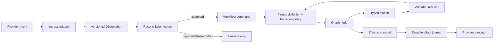

# Forge 2.0 control-plane architecture for developers

This is the developer and architect guide to the control-plane stack delivered
by PRs 324–332. It explains the design intent, the ownership rules that replace
the pre-2.0 implementation style, and how to extend Forge without bypassing
the new correctness boundaries.

For release, deployment, and operator procedures, see
[`../forge-2.0-control-plane-guide.md`](../forge-2.0-control-plane-guide.md).

## The architectural shift

Pre-2.0 Forge was principally a LangGraph application: queue deliveries entered
the worker, nodes interpreted provider payloads, invoked agents, mutated the
checkpoint, and called Jira or GitHub as needed. That worked for the golden
path, but process correctness was distributed across node code, event handlers,
provider adapters, and retry logic.

Forge 2.0 makes Forge a **durable workflow control plane**. LangGraph remains
the graph execution adapter; it is no longer the public definition of a Forge
process. The following records are now first-class architectural boundaries:

| Record | Source of truth | What it answers |
| --- | --- | --- |
| Observation | Jira, source control, or poller | What external fact was received? |
| Observation decision | Reconciliation ledger | Is that fact accepted, duplicate, stale, or conflicting? |
| Workflow command | Command boundary | What state transition or exceptional operation does the accepted fact request? |
| Pinned definition/checkpoint | Forge | Which immutable process revision and position owns this run? |
| Station attempt | Forge | What bounded operation was requested, and what validated result did it return? |
| Effect record | Effect journal | Which external write was intended, attempted, and observed? |
| Execution read model/timeline | Forge projection | Why is this run at its current state? |

The key rule is: **external systems own their facts; Forge owns interpretation
and process state.** A Jira/GitHub payload cannot directly set `current_node`,
pause/retry state, workflow identity, or an effect-journal field.



## Dependency and PR map

The stack's dependency order is not entirely numerical:

```
324 -> 325 -> 326 -> 327 -> 328 -> 331 -> 329 -> 330 -> 332
```

PR 331 is an ancestor of PR 329; PR 330 depends on 329; PR 332 depends on 330.
Architecturally, the stack implements eight layers:

| Layer | PR | Design responsibility |
| --- | --- | --- |
| 1 | 324 | Versioned domain contracts and provider-neutral source-control observations |
| 2 | 325 | Normalized ingress and semantic workflow commands |
| 3 | 326 | Durable, recoverable external effects |
| 4 | 327 | Typed station/projection/reducer execution boundary |
| 5 | 328 | Governed, declarative, pinned process definitions |
| 6 | 331 | Observation reconciliation across webhook and poller ingress |
| 7 | 329 | Execution read models, timeline, and Org Pulse projection |
| 8 | 330/332 | Removal of legacy paths; definitions as sole topology; strict structured outputs |

## Layer 1: domain contracts and provider neutrality (PR 324)

`src/forge/domain/` establishes versioned Pydantic contracts for observations,
commands, effects, identities, interactions, and stations. Code crossing a
system boundary should use these contracts rather than an ad-hoc `dict` or a
provider SDK object.

Source control is now represented by contracts and adapters under
`src/forge/integrations/source_control/`. GitHub is an adapter implementation,
not a workflow dependency. Its events are adapted into `Observation` values
with a stable resource identity, provider revision, facts, correlation, and a
delivery identity.

### Consequences for new providers

To support another source-control provider, add a conforming adapter and
observation mapping. Do not add provider-specific conditionals to a workflow
node. The adapter must define stable resource and delivery identities and,
where the provider supports it, ordering/revision metadata. If the provider
cannot provide safe ordering data, the system should surface ambiguity instead
of inventing an ordering rule.

## Layer 2: commands are the only ingress into process control (PR 325)

Ingress adapters under `src/forge/orchestrator/event_adapters/` turn raw queue
events into observations. `command_handlers.py` and the command-operation
boundary derive a `WorkflowCommand` only after an observation is reconciled.
This applies to Jira approval labels, comment commands, retry requests, review
events, CI results, and exceptional actions such as `/forge rebase`.

This separates three decisions that were formerly easy to conflate:

1. Did the provider report a coherent, sufficiently new external fact?
2. What semantic action does that fact express?
3. Does the currently pinned workflow allow that action at its saved position?

### Development rule

Never advance a graph from a webhook handler, a poller payload, or a label
parser. Add/extend an observation adapter, command derivation, and the relevant
workflow transition policy. An unrecognized command must remain observable but
must not mutate workflow state.

## Layer 3: external writes are durable effects (PR 326)

`src/forge/effects/` replaces best-effort direct mutation with the effect
journal/executor/service pattern:

1. Construct a stable `EffectCommand` with workflow identity, operation,
   target, and idempotency identity.
2. Submit it to the Redis-backed journal *before* contacting a provider.
3. Claim a lease so only one executor owns the attempt.
4. Execute the registered provider executor.
5. Persist the resulting provider evidence, status, and attempt history.

The journal states distinguish pending/running work from retryable,
precondition, terminal, and successful results. Transient failures use bounded
backoff. A recovery sweep executes due records. A workflow-critical effect can
wait for a concurrent sweep owner to settle; it does not treat exclusive lease
ownership as a failure. Retryable and terminal outcomes nevertheless fail
closed and prevent an unsafe process advance.

### Why idempotency is non-negotiable

The sequence “provider mutated successfully, worker died before checkpoint
write” is unavoidable in distributed systems. Retrying the agent or node may
create duplicate comments, branches, issues, or PRs. Retrying a stable effect
identity instead converges on the intended mutation and preserves its history.

### Development rule

Do not instantiate a Jira/GitHub/repository client to make a workflow-visible
write from a node, station, or command handler. Register an executor and emit
an allowed `EffectCommand` through `effect_runtime`. Reads may still use the
appropriate adapter. New effect operations must be declared in the trusted
effect catalog and granted only to the relevant trusted nodes.

## Layer 4: typed stations narrow agent and execution authority (PR 327)

The station runtime separates orchestration from work execution:

- A **projector** selects the permitted fields from the checkpoint and creates
  a versioned `StationRequest`.
- A **station** performs one bounded operation: approval classification,
  artifact generation, triage, task routing, agent operation, implementation
  input resolution, sandbox execution, or persistence.
- A **reducer** validates the `StationOutcome` and applies only the state fields
  owned by that station.

Station definitions and the registry live under `src/forge/workflow/stations/`;
projectors and reducers live in their corresponding packages. The node remains
responsible for orchestration and routing, not for open-ended provider access.

This preserves the product split: planning/review agents execute on the host;
implementation runs in the rootless Podman sandbox. The sandbox receives
repository/model execution material but not Jira, Redis, or source-control
credentials. Provider writes return to the host durable-effect boundary.

### Development rule

When adding a new agent or sandbox operation, define a typed input/output
contract first. Keep it narrow, version it, project only owned input, and add a
reducer that rejects malformed or unauthorized output. Do not pass the entire
LangGraph state into a new agent as a convenience.

## Layer 5: workflows are governed, declarative processes (PR 328)

`src/forge/workflow/declarative/` owns definition parsing, validation,
publication, resolution, manifest generation, catalog lookup, compilation, and
migration analysis. Built-in Feature, Bug, and Task Takeover definitions are
canonical JSON artifacts in `definitions/`; human-authored project definitions
are YAML or JSON and are published as canonical JSON to Jira project properties.

A definition is intentionally flow-only:

```yaml
metadata:
  name: prd-only
  revision: 1
spec:
  state: feature
  entry: generate_prd
  steps:
    generate_prd:
      next: prd_approval_gate
    prd_approval_gate:
      route: route_prd_approval
      branches:
        generate_spec: __end__
        regenerate_prd: generate_prd
        __end__: __end__
```

The definition determines topology: state profile, entry, nodes, fixed edges,
routed branches, dynamic fan-out, joins, and retry/concurrency flow settings.
The trusted catalog determines execution authority: node identity, station
contract, effect capabilities, required policies, preconditions, and
observation behavior. A project author cannot grant itself an effect capability
or weaken a mandatory policy by editing YAML.

Each created workflow pins the selected definition name, revision, digest, and
canonical payload in the checkpoint. Publication changes what future tickets
select; it does not silently rewrite a running ticket.

### Definition authoring rule

Run `forge workflow catalog <feature|bug|task_takeover>` before authoring and
use only reported nodes/routers. Then run `validate`, `render`, and `diff`.
Every static router outcome must appear in its `branches` map. If a saved node
is renamed/removed, increment `metadata.revision`, provide
`spec.resume.fromRevisions`, and run `simulate-migration` against real or
representative checkpoints. Valid YAML alone does not prove resumption safety.

## Layer 6: reconciliation makes multiple ingress sources converge (PR 331)

The Redis observation ledger is the precondition for command interpretation.
It tracks resource identity, delivery identity, provider revision, decision,
drift class, and per-run history. Equivalent webhook and poller deliveries
therefore become one logical external observation.

The ledger classifies observations as accepted, duplicate, stale, or conflict.
It also blocks attempts by an external payload to assert workflow-owned facts.
An orderable provider revision is preferred. When a provider supplies opaque or
unversioned revisions that cannot safely be ordered, Forge records the reason
and does not pretend the event is newer.

### Architectural consequence

At-least-once delivery is expected, not exceptional. A new integration must be
correct under duplicate delivery, out-of-order delivery, and a poller/webhook
race. “The handler is idempotent in practice” is insufficient: it must produce
a stable observation identity and let the ledger make the ordering decision.

## Layer 7: read models are projections, not an alternate control path (PR 329)

`src/forge/read_models/` composes independent durable records into an
operator-facing execution model and timeline. It does not execute nodes or read
current Jira labels to infer process state. Its sources are the pinned
definition/checkpoint, observation decisions, station attempts, and effects.

The gateway exposes:

```text
GET /api/v1/workflows/{ticket_key}/execution
GET /api/v1/workflows/{ticket_key}/execution/timeline
GET /api/v1/org-pulse/workflows/{ticket_key}
GET /api/v1/effects/workflow/{run_id}
GET /api/v1/effects/{idempotency_key}
POST /api/v1/effects/{idempotency_key}/replay
```

The APIs are protected by `FORGE_OPERATOR_TOKEN`. The replay endpoint is the
only mutation endpoint in this group, and it only requeues an eligible terminal
effect; it does not rerun a station or advance the graph.

### Development rule

Add diagnostic data at its authoritative boundary (observation decision,
station attempt, effect result, checkpoint transition), then project it into
the timeline. Do not add an API endpoint that recalculates workflow state from
provider data or performs hidden recovery work in a GET request.

## Layer 8: the cutover is intentionally strict (PRs 330 and 332)

The final PRs remove Phase 8 compatibility paths, move observation transitions
behind policy, make definitions the sole source of graph topology, complete
built-in effect-capability declarations, and enforce structured model outputs.
Structured stages use Pydantic output contracts with provider-native structured
output and validated fallback strategy; narrative artifacts remain Markdown.

The strictness is intentional:

- an undeclared router outcome is an error, not an inferred transition;
- an unknown workflow label/definition blocks instead of falling back;
- invalid structured output is rejected and retried/escalated according to the
  workflow rather than parsed optimistically;
- a node cannot emit an effect operation absent from its trusted capability set;
- external facts cannot overwrite process-owned checkpoint facts.

This is a Forge 2.0 major-version boundary. Old direct-mutation extensions and
legacy checkpoints should be drained, resolved, or explicitly migrated rather
than assumed resumable.

## How to implement a change after the cutover

Use this sequence for a new lifecycle capability:

1. **Classify the boundary.** Is it a provider fact, a semantic user/provider
   command, a workflow topology change, a bounded station operation, or an
   external effect? One feature can require several, but do not collapse them.
2. **Define versioned contracts.** Add/change domain, station, or structured
   output models before implementation.
3. **Adapt and reconcile ingress.** For external input, create a stable
   observation and command mapping, then define how transition policy consumes
   the command.
4. **Use a station for work.** Add projector, station, reducer, and contract
   tests. Preserve ownership boundaries in the reducer.
5. **Use an effect for writes.** Add a stable operation, executor, catalog
   capability, and retry/idempotency tests.
6. **Change topology declaratively.** Update the trusted catalog/built-in
   definition as appropriate, increment definition revision, and validate,
   render, diff, and simulate migration.
7. **Expose evidence.** Ensure the resulting observation/command/station/effect
   is visible in the execution timeline and that operator errors are actionable.
8. **Test convergence.** Cover replay, duplicate/out-of-order ingress, worker
   restart around effects, unauthorized output/effects, and pinned-definition
   behavior—not only the happy-path graph execution.

## Design mistakes the new architecture is meant to prevent

| Avoid | Use instead | Reason |
| --- | --- | --- |
| Calling Jira/GitHub directly in a node | Effect command and registered executor | Provides idempotency, recovery, audit, and authority checks. |
| Routing directly from a webhook | Observation -> ledger -> command -> policy | Makes duplicate and stale delivery safe. |
| Adding a Python branch to change a workflow's flow | Definition/catalog change | Keeps topology inspectable, versioned, and migratable. |
| Giving an agent the full checkpoint | Projected station request | Limits authority and makes output ownership auditable. |
| Treating an LLM JSON string as trusted | Structured output contract plus reducer validation | Rejects malformed or unauthorized state changes. |
| Retrying the whole workflow after a provider failure | Replay/repair the individual effect | Avoids repeating agent work and duplicating writes. |
| Deriving status from live Jira labels in an API | Durable execution read model | Preserves causal process history. |

## Integration fixes validated with the stack

The integration branch contains production fixes found while exercising all
three workflows. These are not separate architectural layers, but they clarify
how the boundaries should work in practice:

- Gate resumption schedules the definition's declared next transition.
- Workspace setup and implementation persistence declare their required
  repository effect capabilities.
- Shared `implement_work` resolves and persists a repository-scoped work unit
  for both task-based and taskless execution.
- A merged PR is a terminal source-control observation even when its head SHA
  is no longer available or differs from a tracked head.
- Feature decomposition keeps its draft in checkpoint state, avoiding a second
  Jira attachment authority.
- Repository labels are reconciled without removing/readding a retained label,
  which would defeat durable-effect deduplication.
- Bug RCA structured output selects one configured repository and only then
  writes the matching `repo:<owner>/<repo>` label.

## Architectural bottom line

The new system has more explicit components because Forge is coordinating
unreliable distributed actors: providers, queues, agents, containers, and
workers. Those components are not optional abstraction layers. They assign one
owner to each fact, decision, mutation, and transition. Future development
should preserve that separation; bypassing it may restore a short path locally,
but reintroduces the duplicate, crash-recovery, and unexplained-state failures
the Forge 2.0 stack is designed to eliminate.
