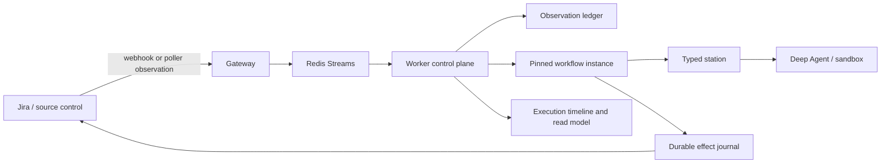

# System and components

Forge is a centralized, durable workflow engine for an agentic SDLC. Jira and source-control
systems remain authoritative for their domain facts. Forge owns process interpretation: the
versioned process definition, each run's pinned definition and position, transition decisions,
station attempts, and external-effect history.

## Runtime responsibilities

- **Gateway** authenticates Jira and source-control webhooks and enqueues their payloads. It
  contains no process-routing rules.
- **Poller** is a peer ingress source. Webhooks improve latency; polling supplies recovery. Both
  become the same versioned `Observation` before process logic sees them.
- **Observation ledger** deduplicates equivalent webhook/poller deliveries, rejects stale or
  conflicting revisions, and prevents external observations from changing workflow-owned facts.
- **Worker** adapts accepted observations into validated commands, resolves the workflow instance,
  and invokes its pinned definition. It does not embed an independent per-ingress workflow.
- **Workflow engine** compiles built-in or project-published definitions to LangGraph. An instance
  pins the definition name, revision, digest, and current position in its durable checkpoint.
- **Stations** implement bounded operations through Forge-owned typed requests and outcomes.
  Projectors and reducers isolate station code from the complete checkpoint and graph runtime.
- **Effect service** journals required Jira, source-control, and repository mutations before
  execution and records attempts and provider evidence for safe recovery or operator replay.
- **Sandbox** runs implementation work in an ephemeral rootless Podman container. It receives the
  repository and model credentials, but not Jira, Redis, or source-control credentials.
- **Read models** combine the pinned process manifest, checkpoint, observation decisions, station
  attempts, and effects into an operator-facing execution status and timeline.

## Process ownership

Forge ships immutable, versioned golden-path definitions for Feature/Story, Bug, and managed
Task/Epic workflows. Project administrators can publish constrained definitions composed only from
registered nodes, routes, gates, stations, and effect capabilities. Definitions cannot execute
arbitrary Python or weaken mandatory policies. See
[Declarative workflows](../reference/declarative-workflows.md).

## Model execution

Planning and review stations use Deep Agents. Data-shaped decisions use strict Pydantic response
contracts with provider-native structured output and a validated tool-strategy fallback; narrative
artifacts remain Markdown. See [Structured model output](structured-output.md).
