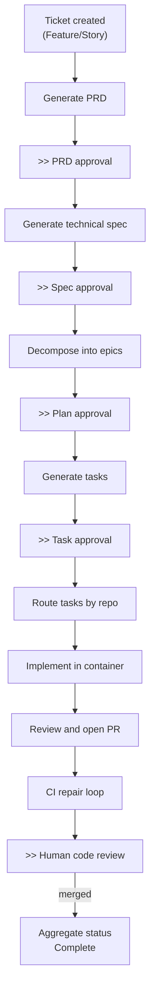
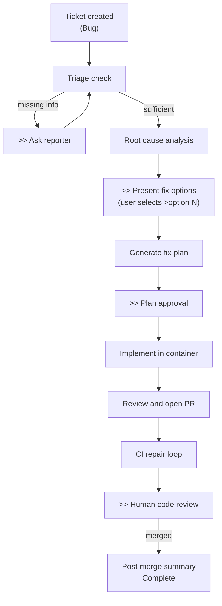
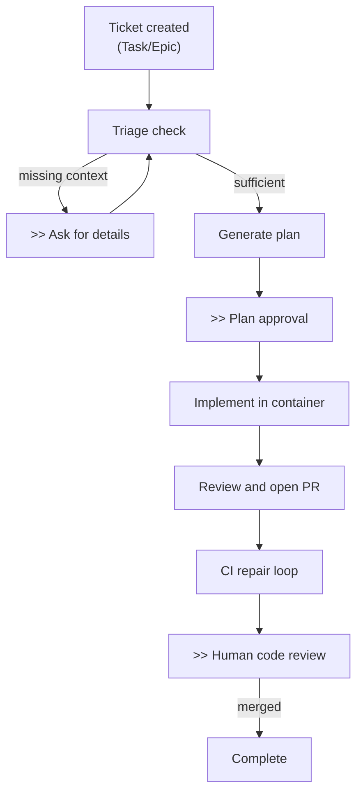

# Reference

## Key Architectural Decisions

### Redis Streams for Event Bus

Use Redis Streams with consumer groups instead of a dedicated message broker (RabbitMQ, Kafka). Redis already serves as the checkpoint store, so reusing it for event queuing eliminates an infrastructure dependency. The tradeoff: no built-in dead-letter queues or cross-datacenter replication.

### Forge-owned definitions compiled to LangGraph

Forge owns the process schema, manifests, station contracts, routing policy, and compatibility
rules. Validated definitions compile to LangGraph `StateGraph` instances and use Redis checkpointing.
LangGraph is an execution adapter rather than Forge's public process contract.

### Authoritative process position with reconciliation

Each workflow instance pins a definition revision and retains its process position. Jira and source
control remain authoritative for external facts. Webhook and poller observations converge in a
revision-aware ledger before Forge interprets them as commands, so reconciliation repairs missed
delivery without silently replacing workflow state.

### Durable external effects

Required external writes are journaled before provider execution and addressed by stable
idempotency identities. This closes the crash window between a successful provider operation and a
workflow checkpoint and permits targeted operator replay.

### Host-Level Podman for Code Execution

Run implementation tasks in rootless Podman containers on the Worker host instead of Kubernetes jobs or remote VMs. This simplifies the container lifecycle but requires Podman on every Worker host.

### Golden paths by issue type

Forge ships versioned Feature, Bug, and Task Takeover definitions. They have distinct planning
stages and reuse registered implementation, CI, and review stations. Project definitions may compose
the registered catalog but cannot add arbitrary executable logic.

### Human Approval Gates

Workflows pause at defined gates and wait indefinitely for human approval. The `forge:yolo` label provides an opt-in escape hatch for autonomous operation. The tradeoff: increased latency for every ticket.

## Known Limitations

- **No automatic PEL reclaim**: Unacknowledged messages from crashed workers require operational
  reclaim.
- **Checkpoint concurrency remains a deployment concern**: Observation acceptance is transactional,
  but deployments must still serialize conflicting execution of one workflow instance.
- **Ingress delivery is at-least-once**: webhook and poller observations are
  deduplicated and classified by the reconciliation ledger, but the gateway
  may still enqueue a retried transport message before the worker records it.
- **Webhook signature validation is optional**: Endpoints accept unsigned payloads when secrets are not configured.
- **No approval gate timeout**: Paused workflows wait indefinitely with no escalation.
- **Single Redis dependency**: No Sentinel, Cluster, or HA. Redis is a single point of failure.
- **No cross-stream ordering**: Jira and GitHub streams are consumed independently with no ordering guarantee.
- **Provider revisions vary**: Resources without a native revision can be deduplicated only by a
  stable provider event identity; Forge reports ambiguous ordering as a conflict.
- **Structured-output support is model-specific**: Explicit model connections must declare the
  `structured_output` capability after their backend/model combination is verified.

## Workflow Lifecycles

`>>` marks human approval gates. Gates are auto-approved when the `forge:yolo` label is set. For detailed node-level flows, see the [Feature](../guide/feature-workflow.md), [Bug](../guide/bug-workflow.md), and [Task](../guide/task-workflow.md) workflow guides.

### Feature Lifecycle

### Bug Lifecycle

### Task Lifecycle

