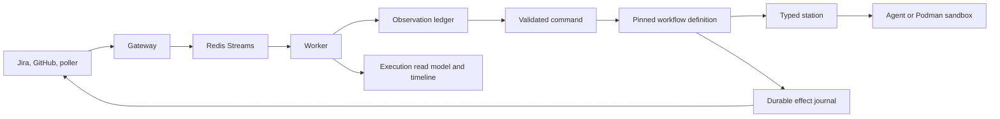

# Forge 2.0 control-plane change guide

This guide describes the stacked control-plane change set in PRs 324–332 and
the operational model it introduces. It is written for operators and project
administrators upgrading from the pre-2.0 Forge runtime.

## What this release is

Forge 2.0 changes the execution architecture, not the product goal. A managed
Jira ticket still drives planning, implementation, CI repair, and human review.
The change is that Forge now records and governs every boundary between an
incoming provider event and an external mutation.

Before this change set, the worker interpreted webhook/poller payloads and
called workflow nodes and provider clients directly. That made normal operation
simple, but left important questions difficult to answer after a retry, worker
crash, duplicate delivery, or workflow-definition change:

- Was this event already handled, and is it newer than the last one?
- What workflow transition did it authorize?
- Did a Jira update, branch push, or pull-request creation happen before the
  worker stopped?
- Can an operator retry one failed provider write without rerunning an agent?
- Which exact workflow definition was the ticket executing?

Forge 2.0 supplies durable answers to those questions. It is a control plane
over the existing Jira, source-control, agent, sandbox, Redis, gateway, and
worker runtime.

## Merge order

The pull requests are a dependency stack, but the final portion is not ordered
by PR number. The required ancestry order is:

```
324 -> 325 -> 326 -> 327 -> 328 -> 331 -> 329 -> 330 -> 332
```

PR 331 is an ancestor of PR 329, PR 329 is an ancestor of PR 330, and PR 330
is an ancestor of PR 332. Merging 329 before 331 would create an avoidable
stacking conflict or duplicate ancestry situation.

## Runtime model after the change



The gateway remains intentionally thin: it authenticates and queues ingress.
The worker owns reconciliation, command interpretation, workflow execution,
and effect recovery. The poller remains an external peer ingress service; it is
not replaced and no new poller process is introduced by this stack.

## New logical services and storage

There are no new mandatory containers in `docker-compose.yml`. Redis, the
gateway, and the host-side worker remain the deployment units. The following
new **logical services** run inside the gateway/worker process and persist to
Redis:

| Component | Runs in | Purpose |
| --- | --- | --- |
| Observation ledger | Worker | Deduplicates and orders Jira/GitHub/poller observations and records why one was accepted, stale, duplicate, or conflicting. |
| Command boundary | Worker | Converts accepted observations and exceptional user actions into typed, validated commands before workflow state changes. |
| Durable effect service | Worker | Journals Jira, source-control, and repository write intent; leases execution; retries transient failures; and permits targeted replay. |
| Typed station runtime | Worker | Runs a bounded operation using a versioned request/output contract rather than giving a node the whole checkpoint and unrestricted provider access. |
| Definition registry/compiler | Worker and CLI | Resolves an immutable built-in or published definition, validates it against the trusted catalog, and compiles it to LangGraph. |
| Execution read model/timeline | Gateway API and worker | Produces an operator view of process position, observations, station attempts, effects, waiting, blocking, and migration status. |

Redis therefore becomes more than the queue and LangGraph checkpoint store. It
also stores observation decisions, effect records and scheduling indexes,
definition/pinning data, and execution timeline records. Preserve Redis during
the release; deleting it discards recovery and audit history.

## What each PR introduces

### PR 324 — versioned workflow domain contracts

Establishes the provider-neutral vocabulary used by the rest of the stack:
identities, observations, commands, interactions, effects, and stations. It
adapts GitHub events into source-control observations and moves implementation
input resolution behind a typed station.

Practical effect: Forge stops treating an inbound webhook payload as workflow
control data. It first turns it into a stable, typed description of an external
fact. This also begins provider-neutral source-control support: GitHub is the
current adapter, while workflow code addresses a source-control contract rather
than GitHub-specific objects.

### PR 325 — command interpretation boundary

Normalizes all ingress at the worker boundary, then derives and persists a
semantic command before applying a state transition. Jira labels/comments,
retries, and exceptional commands use the same model; source-control review
enrichment is isolated from graph execution.

Practical effect: a label or comment no longer changes checkpoint state merely
because it arrived. The command must be recognized and allowed by the active
workflow transition policy. Ignored events retain a durable identity and an
explanation instead of being invisible.

### PR 326 — durable external effects

Introduces the durable effect journal and executors for Jira, source control,
repository pushes, files, notifications, and workflow relationship updates.
Required writes are submitted before a provider call, executed under an
exclusive lease, retain attempt/provider evidence, and retry with bounded
backoff. Terminal effects can be explicitly replayed by an operator.

Practical effect: a worker failure between deciding to create a PR and receiving
the provider response no longer requires rerunning the planning or implementation
agent. Forge recovers the individual mutation by its stable idempotency key. A
required effect that is retryable or terminal still blocks forward progress:
Forge fails closed rather than assuming the side effect happened.

### PR 327 — typed station boundary

Moves agent calls, approval handling, planning, task routing, sandbox execution,
review inference, and post-merge persistence behind typed stations. Projectors
construct the narrow request a station may see; reducers validate the station
outcome and apply only fields that station owns.

Practical effect: workflow nodes become orchestration code rather than direct
provider/agent clients. Planning and review stay host-side; implementation stays
in the existing rootless Podman sandbox. Sandboxes still do not receive Jira,
Redis, or source-control credentials. This is a safety and testability boundary,
not a new agent service to run.

### PR 328 — governed, declarative workflows

Adds versioned process definitions, a trusted node/router/station catalog,
definition validation, publication/activation controls, manifests, and migration
simulation. Built-in Feature, Bug, and Task Takeover workflows are published as
immutable JSON artifacts and compiled from their topology.

Practical effect: flow topology is no longer implicitly defined by Python graph
wiring. Each run pins a definition name, revision, digest, state profile, and
position. A later publication cannot silently alter an in-flight ticket.
Administrators may publish a constrained YAML/JSON workflow with registered
nodes only; they cannot add Python, shell, credentials, provider calls, or new
effect authority. The trusted catalog—not the definition author—assigns allowed
effects, station contracts, preconditions, and observation policy.

### PR 331 — webhook and poller reconciliation

Adds the convergent observation ledger and reconciles every observation before
command interpretation. Equivalent deliveries from a webhook and the poller
converge; stale revisions, contradictory revisions, and attempts to set
workflow-owned facts are recorded and rejected.

Practical effect: ingress is at-least-once, but its workflow consequences are
convergent. A duplicate check-suite, review, or ticket event will not advance a
workflow twice. Forge intentionally refuses to guess when a provider supplies no
orderable revision or sends contradictory facts; that produces an observable
conflict for an operator instead of unsafe state movement.

### PR 329 — execution read models and timeline

Adds durable execution read models and timeline construction, plus a compact
Org Pulse projection. It joins the pinned manifest/checkpoint with command and
observation decisions, station attempts, and effect history.

Practical effect: operators no longer need to reconstruct a workflow from
worker logs and Jira comments. They can inspect why a ticket is waiting,
blocked, stale, conflicted, or migration-ineligible, and see the relevant
attempts and external writes in order.

### PR 330 — remove compatibility execution paths

Removes the transitional Phase 8 compatibility paths and makes policy-governed
observation transitions authoritative. Legacy direct paths are deliberately no
longer available.

Practical effect: this is the principal Forge 2.0 compatibility boundary. The
new control-plane rules are not optional fallbacks. Do not expect a pre-2.0
checkpoint or custom extension that relied on direct node/provider mutation to
continue executing unchanged.

### PR 332 — complete the cutover and enforce structured output

Makes definitions the sole source of graph topology and keeps them flow-only.
Completes built-in effect capability declarations and governed side effects,
adds strict structured agent-output validation, accepts valid JSON-array triage
output, and verifies built-in workflow revision behavior.

Practical effect: an undeclared router result, an invalid structured artifact,
or a node attempting an unauthorized effect is an explicit failure, not a best
effort continuation. This explains errors such as `router returned undeclared
outcome`: they reveal a definition/catalog contract mismatch that must be fixed
rather than guessed around.

## Changes to the three workflows

The Feature, Bug, and Task Takeover lifecycles remain familiar to users:
approvals still pause work and CI/human-review signals still govern pull-request
completion. Their execution semantics are now shared and durable.

| Area | Prior behavior | Forge 2.0 behavior |
| --- | --- | --- |
| Approval and revision | Ingress-specific node handling could directly advance a graph. | A reconciled observation produces a validated command that the pinned definition allows or rejects. |
| Agent work | Nodes could call agents/providers with broad state context. | Typed stations use a bounded request, typed outcome, and reducer-owned state fields. |
| Jira/SCM writes | A crash could leave uncertainty or cause a duplicate on retry. | Each write has an effect identity, journal status, attempts, provider evidence, and controlled replay. |
| PR/CI/review events | Webhook and poller events could be processed as separate deliveries. | Both are observations of the same resource and reconcile before workflow interpretation. |
| Workflow changes | Runtime graph wiring was the effective definition. | A run pins an immutable definition revision and digest. |
| Diagnostics | Jira and logs were the primary reconstruction tools. | Read-only execution/timeline APIs expose durable process evidence. |

The implementation path is additionally standardized around the `implement_work`
node. It resolves a scoped work unit from the current task, repository-specific
task/epic plan, general plan, spec, RCA, PRD, or root ticket in that order, and
persists its identity and artifact digests. This is why taskless and task-based
workflows can share one safe implementation engine.

## New operator and administrator interfaces

### Workflow-definition CLI

```bash
forge workflow catalog feature
forge workflow validate workflow.yaml
forge workflow render workflow.yaml
forge workflow diff previous.yaml current.yaml
forge workflow simulate-migration previous.yaml current.yaml instances.json
forge workflow publish MYPROJECT workflow.yaml
forge workflow list MYPROJECT
forge workflow show MYPROJECT workflow-name
forge workflow show-history MYPROJECT workflow-name
```

Use YAML as the authoring format. Publication stores canonical JSON in the Jira
project property and requires Jira project/global administration permission.
Select a published workflow with `forge:workflow:<name>`; without that label,
Forge uses the built-in ticket-type workflow. Multiple workflow labels, an
unknown definition, or invalid content block execution rather than falling back.

### Operator APIs

These read/operate on durable state and require `FORGE_OPERATOR_TOKEN` as a
Bearer token. Without it the operator API is disabled (503); a missing or bad
token receives 401.

```text
GET  /api/v1/workflows/{ticket_key}/execution
GET  /api/v1/workflows/{ticket_key}/execution/timeline?cursor=0&limit=50
GET  /api/v1/org-pulse/workflows/{ticket_key}
GET  /api/v1/effects/workflow/{run_id}
GET  /api/v1/effects/{idempotency_key}
POST /api/v1/effects/{idempotency_key}/replay
```

Effect replay is intentional operator recovery for a terminal effect; it does
not rerun an agent or blindly advance the workflow.

## Release and operational implications

1. Treat this as a major-version cutover. The stack removes legacy compatibility
   paths. Drain or explicitly resolve active pre-2.0 workflows before deploying
   it. Do not assume they can resume under the new runtime.

2. Keep the existing services running: Redis, the Forge gateway, the host worker,
   and (where used) forge-poller. Restart the gateway and worker after deploying
   the code so the new routes, catalog, and worker dependencies are loaded. The
   worker continues to own the Podman runtime.

3. Preserve Redis. It now holds recovery/audit records as well as queues and
   checkpoints. Do not apply a broad Redis flush as part of deployment.

4. Configure `FORGE_OPERATOR_TOKEN` before relying on the new inspection or
   replay APIs. Restrict the token to trusted operators; replay performs an
   external provider mutation.

5. Continue to configure production webhook secrets. The gateway validates Jira
   and source-control signatures when their secrets are configured; production
   should configure both. Poller deliveries must use the intended forwarding
   configuration.

6. Review custom definitions and integrations. Definitions must be flow-only and
   use catalog-listed names. Provider mutations must cross the effect service;
   old extensions that call Jira/GitHub or mutate checkpoints directly must be
   migrated to stations/effects/command handlers.

7. Update runbooks and alerts. A `blocked` workflow may now mean an explicit
   effect precondition/terminal failure, invalid station output, unrecognized
   command, stale/conflicting observation, or a missing definition route. Use
   the execution timeline before retriggering a ticket.

## Integration hardening applied during validation

The integration branch also includes follow-up fixes discovered by exercising
Feature, Task Takeover, and Bug workflows. They should ship with the stack:

- approval-gate resume schedules the intended next transition;
- required effects wait briefly for a concurrent recovery sweep that owns the
  same idempotent write, while still failing closed on retryable/terminal errors;
- workspace setup and shared implementation have the declared effect authority
  required for repository persistence;
- merged pull requests reconcile as a terminal event without depending on an
  otherwise unknowable head SHA;
- feature decomposition no longer needs a duplicate Jira draft attachment—the
  workflow checkpoint is authoritative;
- task-plan revisions reconcile repository labels safely; and
- bug RCA now selects one configured repository in structured output and writes
  the matching `repo:<owner>/<repo>` Jira label only after validation.

## Bottom line

Forge still automates the same delivery workflow. Forge 2.0 makes its control
decisions, external writes, and operational evidence explicit, durable, and
inspectable. The cost is stricter contracts and a real major-version migration
boundary; the benefit is safe recovery and explainability when distributed
events, providers, agents, and workers inevitably retry or disagree.
